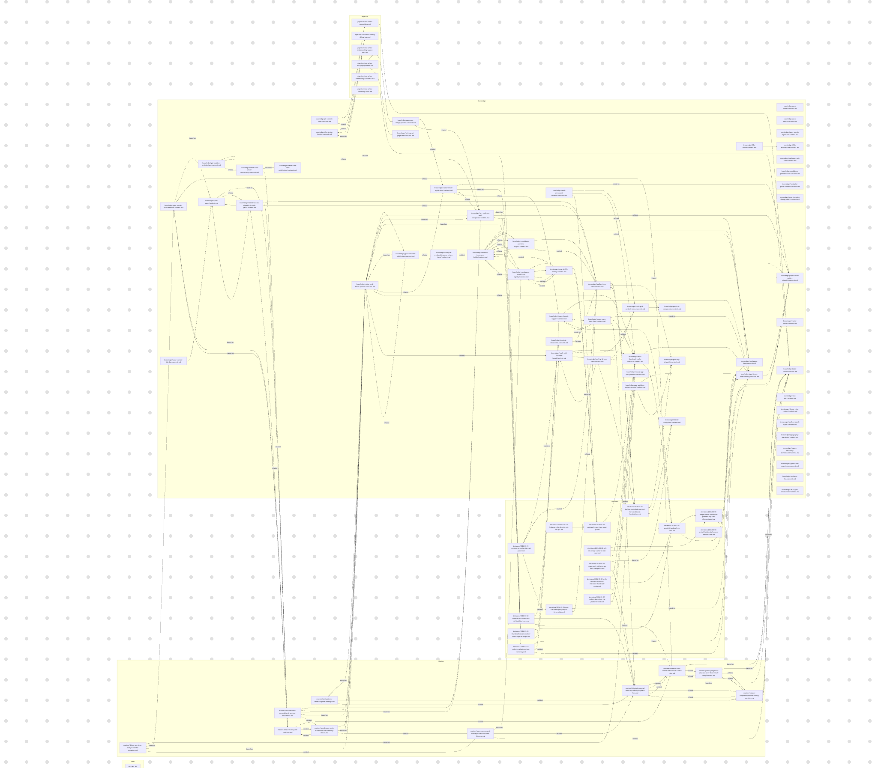
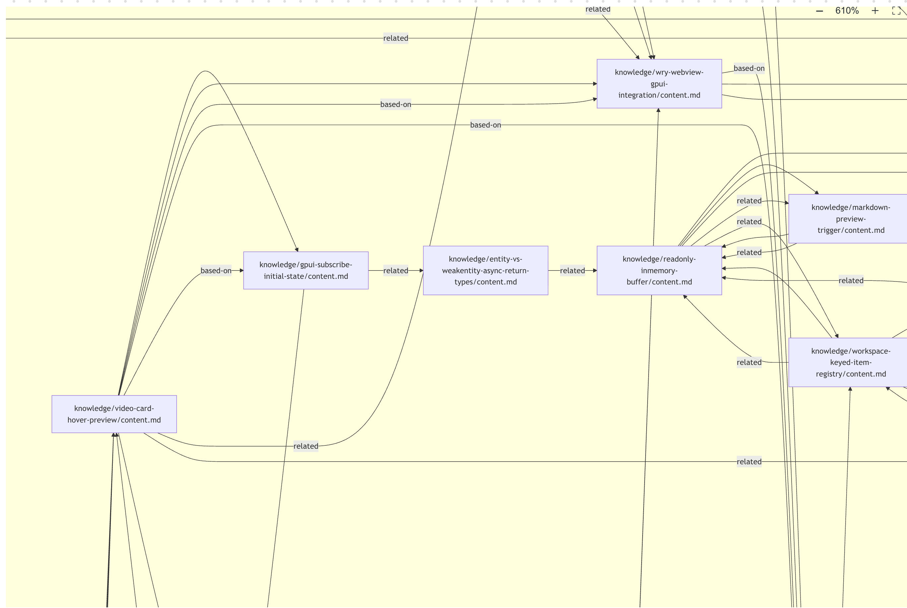

<div align="center">

# Pensieve

**给 AI agent 一套持续生长的项目记忆。**

[](https://github.com/kingkongshot/Pensieve/stargazers)
[](LICENSE)

[English README](https://github.com/kingkongshot/Pensieve/blob/main/README.md)

</div>

**一句话理解：Pensieve 是一个会自我生长的 CLAUDE.md，以 skill 形式运行——极少占用上下文，适配所有支持 skill 的 AI 工具。**

| | CLAUDE.md / agents.md | Pensieve |
|---|---|---|
| 形式 | 单个静态文件 | 四层结构化知识 |
| 维护 | 手动写、手动更新 | 自动沉淀、自动对齐 |
| 范围 | 项目约定 | 约定 + 决策 + 事实 + 流程 |
| 关联 | 平铺 | 语义链接形成图谱 |
| 上下文占用 | 全文注入 | skill 按需路由，极少占用 |

## 为什么用 Pensieve

| 没有 | 有 |
|---|---|
| 每次都要重新解释项目规范 | 规范存为 maxim，自动加载 |
| 代码审查标准看心情 | 审查标准固化为可执行的 pipeline |
| 上周犯的错这周再犯一次 | 教训自动沉淀，下次直接跳过 |
| 三个月后忘了当初为什么这么设计 | decision 记录上下文和替代方案 |
| 每次都要重新翻文档定位模块边界 | knowledge 缓存探索结果，直接复用 |

## 自增强循环

Pensieve 不只是存文档——它让 agent 的每一次对话都更精准：

- **校验 AI 生成的方案** — `"用 pensieve 检查这个 plan 的准确性"` → 自动对照 maxim 和 decision，不符合架构约定的方案在执行前就被拦截
- **缩小探索范围** — `"用 pensieve 定位支付模块的入口"` → knowledge 里有上次探索的结果，直接复用，不再全局搜索，节省 token 和时间
- **建立隐性关联** — `"用 pensieve 分析这次重构会影响哪些流程"` → 四层知识通过语义链接形成图谱，顺着关联链发现设计意图和依赖关系
- **减少重复确认** — `"用 pensieve 的规范提交代码"` → 规范和决策已沉淀，不再反复问"用什么风格？""边界在哪？"

你不需要手动维护知识库——日常开发自动喂养它：

```
    开发 ──→ 提交 ──→ 审查（pipeline）
     ↑                      │
     │   ← 自动沉淀经验 ←   │
     │                      ↓
     └── maxim / decision / knowledge / pipeline
```

- **编辑时**：Write/Edit 后自动同步知识图谱（Claude Code 通过 hook 自动触发；其他客户端可手动执行 `self-improve`）
- **审查时**：按项目 pipeline 执行，结论回流为 knowledge
- **复盘时**：`"用 pensieve 沉淀这次经验"` → 洞察写入对应层

你把握方向，Pensieve 帮你避坑。

## 四层知识模型

| 层 | 类型 | 回答什么 | 跨项目？ |
|---|---|---|---|
| **MUST** | maxim | 什么绝对不能违反？ | 是——换项目换语言都成立 |
| **WANT** | decision | 为什么选这个方案？ | 否——当前项目的主动取舍 |
| **HOW** | pipeline | 这个流程应该怎么跑？ | 视情况 |
| **IS** | knowledge | 当前事实是什么？ | 否——可验证的系统事实 |

层与层之间通过 `基于 / 导致 / 相关` 三类语义链接形成图谱。随着使用积累，Pensieve 自动构建项目知识的有向图：




详细规范见 `.src/references/` 下的 [maxims.md](.src/references/maxims.md)、[decisions.md](.src/references/decisions.md)、[knowledge.md](.src/references/knowledge.md)、[pipelines.md](.src/references/pipelines.md)。

## 五个工具

| 工具 | 做什么 | 触发示例 |
|---|---|---|
| `init` | 创建数据目录，种子化默认内容 | "帮我初始化 pensieve" |
| `upgrade` | 刷新 skill 源码 | "升级 pensieve" |
| `migrate` | 迁移旧版本数据，对齐种子文件 | "迁移到 v2" |
| `doctor` | 只读扫描，检查结构和格式 | "检查数据有没有问题" |
| `self-improve` | 从对话和 diff 中提取洞察，写入四层知识 | "把这次经验沉淀下来" |

工具边界与重定向规则见 [tool-boundaries.md](.src/references/tool-boundaries.md)。

## 你在找 Linus 引导词？

Pensieve 最初以一段 Linus Torvalds 风格的引导词为人所知——用"良好的品味"、"不破坏用户态"、"偏执于简单"来约束 agent 的行为。

那套工程哲学仍然是 Pensieve 的内核，但不再是一段孤立的提示词。它现在内置为可执行的准则，agent 从第一天起就有"好品味"：

| 类型 | 内置内容 | 效果 |
|---|---|---|
| maxim | 4 条 Linus 风格工程准则 | agent 不写补丁式代码，先简化再扩展，不破坏已有行为 |
| pipeline | 提交审查 + 代码审查 | 每次提交和审查自动对照准则，结论回流为 knowledge |
| knowledge | 代码品味审查标准 | 什么是"好代码"有了可执行的定义 |

试试：`"用 pensieve review 最近提交的代码品味如何"` 或 `"用 pensieve commit 本地修改"`。

## 安装

前置条件：`git`、`bash`、`Python 3.8+`。

<details>
<summary><b>Claude Code</b></summary>

```bash
# 1. 全局安装（只需一次）
git clone -b zh https://github.com/kingkongshot/Pensieve.git ~/.claude/skills/pensieve

# 2. 安装 hooks（推荐，编辑后自动同步知识图谱、会话启动时自动检查状态）
bash ~/.claude/skills/pensieve/.src/scripts/install-hooks.sh

# 3. 在你的项目中初始化
cd <your-project>
bash ~/.claude/skills/pensieve/.src/scripts/init-project-data.sh
```

</details>

<details>
<summary><b>其他客户端（Cursor / 通用 Agent 等）</b></summary>

将 `<skill-path>` 替换为客户端对应的 skill 目录（如 `~/.cursor/skills/pensieve`）。

```bash
# 1. 全局安装（只需一次）
git clone -b zh https://github.com/kingkongshot/Pensieve.git <skill-path>

# 2. 在你的项目中初始化
cd <your-project>
bash <skill-path>/.src/scripts/init-project-data.sh
```

</details>

系统代码全局安装一次，用户数据按项目存储在 `<project>/.pensieve/`。多个项目共享同一份系统代码，各自维护独立的项目知识。

<details>
<summary><b>AI agent 自动安装参考</b></summary>

当用户要求 AI agent 安装 Pensieve 时，agent 应按以下决策流程执行。以下以 `SKILL_PATH` 代指客户端对应的安装路径（如 `~/.claude/skills/pensieve`）。

**第一步：检查全局安装状态**

```bash
SKILL_PATH="$HOME/.claude/skills/pensieve"  # 按客户端调整

if [[ -d "$SKILL_PATH/.src" ]]; then
    echo "Pensieve 已全局安装，跳过 clone"
else
    SKILL_PARENT="$(dirname "$SKILL_PATH")"
    # 检查父目录是否是 git 仓库（某些用户用 git 同步配置）
    if git -C "$SKILL_PARENT/.." rev-parse --is-inside-work-tree >/dev/null 2>&1; then
        git -C "$SKILL_PARENT/.." submodule add -b zh https://github.com/kingkongshot/Pensieve.git "skills/pensieve"
    else
        git clone -b zh https://github.com/kingkongshot/Pensieve.git "$SKILL_PATH"
    fi
    # hooks 是 Claude Code 专属功能，其他客户端跳过此步
    # bash "$SKILL_PATH/.src/scripts/install-hooks.sh"
fi
```

**第二步：判断是否执行项目初始化**

```bash
# 如果当前目录就是 skill 的父级配置目录，不要自动初始化项目数据
CURRENT_DIR="$(pwd)"
CONFIG_DIR="$(cd "$(dirname "$SKILL_PATH")/.." 2>/dev/null && pwd)"
if [[ "$CURRENT_DIR" == "$CONFIG_DIR" ]]; then
    echo "当前目录是配置目录，跳过项目初始化。如需在此目录使用 Pensieve，请明确告知。"
    exit 0
fi
```

**第三步：检查旧版本数据并初始化**

```bash
HAS_LEGACY=0
for legacy_dir in .claude/skills/pensieve .agents/skills/pensieve skills/pensieve .claude/pensieve; do
    if [[ -d "$legacy_dir" ]] && [[ -d "$legacy_dir/maxims" || -d "$legacy_dir/decisions" || -d "$legacy_dir/knowledge" || -d "$legacy_dir/pipelines" ]]; then
        HAS_LEGACY=1
        break
    fi
done

if [[ "$HAS_LEGACY" -eq 1 ]]; then
    echo "检测到旧版本 Pensieve 用户数据，是否迁移到 v2？"
    bash "$SKILL_PATH/.src/scripts/init-project-data.sh"
    bash "$SKILL_PATH/.src/scripts/run-migrate.sh"
    bash "$SKILL_PATH/.src/scripts/run-doctor.sh" --strict
elif [[ -d .pensieve ]]; then
    echo "当前项目已初始化 Pensieve"
else
    bash "$SKILL_PATH/.src/scripts/init-project-data.sh"
fi
```

> **要点总结**：先检查全局安装 → 判断父目录是否 git 仓库决定 clone/submodule → 跳过配置目录的项目初始化 → 检测旧数据决定 init/migrate。

</details>

<details>
<summary><b>更新</b></summary>

```bash
# 更新系统代码（一次操作，所有项目生效）
cd <skill-path>
git pull --ff-only || { git fetch origin && git reset --hard "origin/$(git rev-parse --abbrev-ref HEAD)"; }

# 在项目中健康检查（可选但推荐）
cd <your-project>
bash <skill-path>/.src/scripts/run-doctor.sh --strict
```

`git pull --ff-only` 适用于正常更新。如果远程分支被 force push（如 squash 后重新发布），ff-only 会失败，此时 `fetch + reset` 会将本地同步到远程最新状态。这是安全的——skill 目录只包含 tracked 系统文件，用户数据在 `<project>/.pensieve/`，不会被覆盖。

完整的安装、更新、重装、卸载说明见 [skill-lifecycle.md](.src/references/skill-lifecycle.md)。

</details>

<details>
<summary><b>从旧版本升级</b></summary>

如果你的 Pensieve 是项目级安装（代码在 `<project>/.claude/skills/pensieve/`），或通过 `claude plugin install` 安装，需要迁移到 v2 架构：

```bash
# 1. 全局安装系统代码（如果尚未安装）
if [[ ! -d <skill-path> ]]; then
    git clone -b zh https://github.com/kingkongshot/Pensieve.git <skill-path>
fi

# 2. 安装 hooks（仅 Claude Code，其他客户端跳过）
# bash <skill-path>/.src/scripts/install-hooks.sh

# 3. 在每个项目中执行迁移
cd <your-project>
bash <skill-path>/.src/scripts/init-project-data.sh
bash <skill-path>/.src/scripts/run-migrate.sh
bash <skill-path>/.src/scripts/run-doctor.sh --strict

# 4. 卸载旧插件（如有，仅 Claude Code）
# claude plugin uninstall pensieve 2>/dev/null || true
```

`run-migrate.sh` 会自动将用户数据（`maxims/`、`decisions/`、`knowledge/`、`pipelines/`）从旧路径移入 `<project>/.pensieve/`，运行时状态从 `<project>/.state/` 移入 `<project>/.pensieve/.state/`，清理旧 graph 文件和 README 副本，然后删除旧版本目录。

</details>

<details>
<summary><b>架构细节</b></summary>

### 目录结构

```text
~/.claude/skills/pensieve/          # 用户级（全局唯一安装）
├── SKILL.md                        #   静态路由文件（tracked）
├── .src/                           #   系统代码、模板、参考文档、核心引擎
│   ├── core/
│   ├── scripts/
│   ├── templates/
│   ├── references/
│   └── tools/
└── agents/                         #   代理配置

<project>/.pensieve/                # 项目级（每项目独立，可纳入版本控制）
├── maxims/                         #   工程准则
├── decisions/                      #   架构决策
├── knowledge/                      #   缓存的探索结果
├── pipelines/                      #   可复用工作流
├── state.md                        #   动态：生命周期状态 + 知识图谱
└── .state/                         #   运行时产物（gitignored）
```

`.src/manifest.json` 是 skill 根目录的锚点——脚本通过它定位所有路径。

### 设计原则

- **系统代码与用户数据物理隔离** — 系统代码在 `~/.claude/skills/pensieve/`，用户数据在 `<project>/.pensieve/`，`git pull` 更新系统不可能触碰项目数据
- **规则单一来源** — 目录、关键文件、迁移路径统一由 `.src/core/schema.json` 定义
- **先确认再执行** — 范围不明确时先问，不自动启动长流程
- **先读规范再写数据** — 创建任何用户数据前先读 `.src/references/` 的格式规范

</details>

## 交流


## 许可证

MIT
